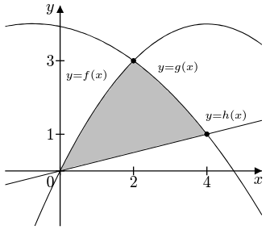
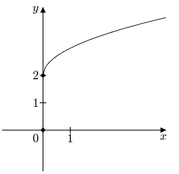
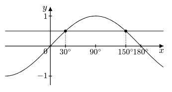
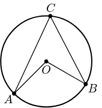
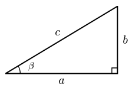
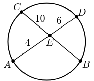
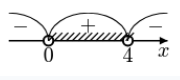
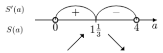

# Docs

Updated: 2026-05-07

> **Tip**: if lazy to read, analyze, learn - just drop the pure command javascript file to some LLM and ask what you want, it will format for you.

_Note: syntax checks atm are minimal._

Comments: use `//` to add comment (to the end of line).

Commands:

- [function](./commands/function.js) - DONE, has issues,
- [interval-arcs](./commands/interval-arcs.js) - almost done,
- [unit-circle](./commands/unit-circle.js) - started,
- [geometry](./commands/geometry.js)
  - triangle - in progress,
  - circle - in progress,
  - cuboid - not started,
  - cone - not started,
  - cylinder - not started,
  - parallelogram - in progress,
  - quadritelateral-pyramid - not started,
  - triangle-pyramid - not started.

## `function`

Start with `function` and then add components.

### Size

`function[small]: ...`

`function[medium]: ...` or just `function: ...`

`function[large]: ...`

### Grid

`function[grid]: ...`

With size - size first: `function[small][grid]: ...`

### Axes

This and other components go after the `function:` part, indicated by keyword, can be separated by any whitespaces.

```
function:
axes Ox [-2;3] {1=A; 2=x_B} x2 Ox [-2;3] {all} x0.5
```

- `Ox` and `Oy` indicates the axis.
- `[start;end]` indicates approximate start/end of axes. If not mentioned - defaults to `[-3;3]`.
- `{-1;0;1}` or `{all}` or `{-1=A; 0=B; 1=C}` indicates the ticks to show on the axis, `=` assigns different label. If not mentioned - defaults to `{}`.
- `x2` or `x0.5` indicates the axis scaling. If not mentioned - defaults to `x1`.

### Graph

```
function:
axes Ox [-3;3] {all} Oy [-1;4] {all}
graph line y=2x+1/2
graph line (-1;2) (2;3)
graph parabola y=-x^2+3x+2
graph hyperbola k=-3 x[-1;] >>f(x-1) >>f(x)+3
graph generic smooth (1;0) ^(2;7) v(3;-1) (4;0)
```

`graph` + `<type>` + `<specification>` + `<x and y ranges>` + `<transformations>`

Types:

- line: `y=kx+b` or `x=a` or `(x_1; y_1) (x_2; y_2)`.
- parabola: `y=ax^2+bx+c` or `y=a(x-r1)(x-r2)` or `y=a(x-m)^2+n` or `(x_1; y_1) (x_2; y_2) (x_3; y_3)`. If not mentioned - defaults to `y=x^2`.
- cubic: `y=ax^3+bx^2+cx+d` or `(x_1; y_1) (x_2; y_2) (x_3; y_3) (x_4; y_4)` (has issues).
- hyperbola: `k=a`
- sqrt, cbrt.
- exp, log: `a=2` or `a=1/2` or `a=0.5` and no other. Default - `a=2`.
- sin, cos, tg, ctg. OX axis scaled by pi/2. That means that 1 means pi/2, 2 means pi etc. And actual graph is not trig(x), but trig(pi/2 x).
- circle: `(x; y) r=a`
- generic smooth: through what points going, `v(x;y)` means "bottom" vertex, `^(x;y)` means "top" vertex, `(x;y)` means not a vertex.
- generic: `(x;y) (x;y) ...` or `y=abs(sin(x^5))...` (free form).

Ranges:

- `x[from;to]`
- `y[from;to]`

Transformations:

```
  >>f(x)+a
  >>f(x+a)
  >>-f(x)
  >>af(x)
  >>f(-x)
  >>f(ax)
  >>|f(x)|
```

### Point

```
function:
graph parabola x[-1;1]
point (-1;1) [A]
point (1;1) (B)
point (0;0) ()
point (2;1) C top left x-line y-line
```

- `[label]` means filled
- `(label)` means hollow
- `label` means just a label
- `x-line` - to the x axis
- `y-line` - to the y axis
- `top left` or `bottom` or `right` - position of the label relative to the point. Default - I:top right, II:top left, III: bottom left, IV:bottom right.

### Area

```
function:
axes Ox[-3;6] Oy[-3;4]
point (0;0) O
point (0;3) [3]
point (3;0) [3]
graph circle r=3
graph parabola y=1/3(x-3)^2
area (2;1) S_1
```

Bucket fill for area, optional label in the center.

### Angle

```
function[large]:
graph line y=-x+2
angle (0;2) (2;0) (3;0) 135^\circ
```

Tree points as in `$\angle ABC$` notation + optional label.

### Examples

```
function[large]:
axes Oy[-1;4]{0;1;3} Ox[-1;5]{0;2;4}
graph parabola (0;0) (2;3) (4;4)
graph parabola (-1;4) (2;3) (4;1)
graph line (0;0) (4;1)
point (0;2.3) _{y=f(x)}
point (2.5;2.5) _{y=g(x)}
point (3.8;1.2) _{y=h(x)}
point (2;3) []
point (4;1) []
area (2;1)
```



```
function[large]:
axes Ox[-1;4]{0;1} Oy[-1;4]{1;2}
point (0;2) []
point (0;0) []
graph sqrt >>f(x)+2
```



```
function:
axes Oy[-0.8;0.8]{-1;0;1} x2 Ox[-0.5;2]{1/3=30^\circ; 1=90^\circ; 5/3=150^\circ; 2=180^\circ} x3
graph sin
graph line y=0.5
point (0.3333;0.5) [] x-line
point (1.6666;0.5) [] x-line
```



### Issues

- graph: domain/range issue. Even points outside the viewport are sometimes calculated that leads to calculation errors, e.g. function exp. (u19750).
- `function: graph cubic (-0.5;0) (0;1) (2;0) (5;0)`
- labels - axis label with `\text{}`, point label with `\sin x` with space! --- introduce `""`?

## `geometry`

In progress...

Start with `geometry` and then add components.

### Size

`geometry[small]: ...`

`geometry[medium]: ...` or just `geometry: ...`

`geometry[large]: ...`

### Circle as basis

_Note: only one basis can be chosen._

_Note: after the keyword "new" the point names can be not mentioned, defaults to ABC, O-OX, ABCDA1B1C1D1, SABC, SABCD etc._

```
geometry:
circle new O-OX
```

`circle + new + <name(center, ray to right)>`

(if name not mentioned - defaults to `O-OX`)

default is radius 2, but can be changed with:

```
circle 5 new
```

### Triangle as basis

```
geometry:
triangle right isosceles new A[B]C >>rot >>rot120 >>invert
```

`triangle + <angular type> + <sides type> + new + <name + special vertex> + [<rotations and inversions>]`

or

```
geometry:
triangle AAS 120 30 new ABC >>rot >>rot120 >>invert
```

`triangle + <congruence rule> + <3 parts> + new + <name> + [<rotations and inversions>]`

angular types:

- acute (default, if not mentioned)
- obtuse (special vertex - obtuse angle, default A)
- right (special vertex - right angle, default A)

side types:

- scalene (default, if not mentioned)
- isosceles (special vertex - different one, default B, if acute)
- equilateral (only acute)

congruence rules:

- SSS, SAS, ASA and AAS.

```
  ┌──────┬───────────────────────────┐
  │ Mode │          Values           │
  ├──────┼───────────────────────────┤
  │ SSS  │ side AB, side BC, side CA │
  ├──────┼───────────────────────────┤
  │ SAS  │ side AB, angle B, side BC │
  ├──────┼───────────────────────────┤
  │ ASA  │ angle A, side AB, angle B │
  ├──────┼───────────────────────────┤
  │ AAS  │ angle A, angle B, side BC │
  └──────┴───────────────────────────┘
```

3 parts:

- 3 numbers, in congruence rule order sides and angles.

rotation (clockwise) and inversion:

- `>>rot` makes next side of triangle "sitting" horizontally.
- `>>rot120` or `>>rot-240` tells in degrees the rotation (as you see in eexample it can be a negative number).
- `>>invert` mirrors by Y axis.

### Quadrilateral as basis

Again starting from bottom left, going clockwise with notation ABCD (default is ABCD).

Includes rotation, like in triangle.

```
geometry:
quadrilateral square new ABCD >>rot45
```

```
quadrilateral square new ABCD
quadrilateral rectangle new ABCD
quadrilateral parallelogram new ABCD
quadrilateral rhombus new ABCD
quadrilateral trapezoid new ABCD
quadrilateral right trapezoid new ABCD
quadrilateral isosceles trapezoid new ABCD
quadrilateral SSSSD 1 2 3 4 2 new ABCD
quadrilateral SSSDD 1 2 3 2 3 new ABCD
quadrilateral SSAAA 3 3 90 90 90 new ABCD
quadrilateral SSSAA 3 3 3 90 90 new ABCD
```

Free form (D-diagonal):

- SSSSD
- SSSDD
- SSAAA (adjacent S)
- SSSAA (included A)

### 3d as basis

```
geometry:
cube new ABCDA1B1C1D1
cube 4 new
cuboid 3x4x5 new
```

3x4x5: length x width x height: AD x AB x AA1

```
geometry:
pyramid quad 4 4 new SABC
pyramid quad new
```

first number - basis, second number - height.

### Naming

_To be extended, more accurate for lines, rays, segments; triangle angle_

Points, line segments, angles, triangles, circles - have their own notation for naming, but by default they are not labeled on the image. They can have different labels than names (tho it would be a bit consufing).

**Point**: single uppercase english alphabet letter with optional following single digit, e.g. A, C, A1, K9.

**Line**: two points, ray and arrow direction matters, e.g. AB, B2C, C2D4.

**Angle**:

- three points, e.g. A1BC
- `angle` + one point, e.g. angle A, that means XAY or YAX for some points X and Y.
- can have amended word `bigger` that means taking the >180 degree angle, not the smaller <180 angle, e.g. angle A1 bigger.

**Triangle**:

- used for now only in triangle segments drawing section.
- three points, e.g. ABC.

**Circle**:

- 3 points, dash between first and two others. one of those two others should be the same as the single one, e.g. A-AB, or K-M1K. the single letter marks center, the two letters marks a ray to the right, B is a point on circle to the right from the center (0 degrees).

### Triangle segments

```
geometry:
triangle new KLM
line perpendicular bisector KLM KL new A B
line angle bisector KLM M new D
line median KLM K new E
line altitude KLM K new F
line midsegment KLM KL LM new G H
```

`line + <triangle segment name> + <triangle name> + <indicative sides or verteces> + new + <names of new verteces>`

### More triangle - circles

```
geometry:
triangle new ABC
circle inscribe ABC new O-OX K L M
circle circumscribe ABC new O-OX
```

Inscribing into triangle - KLM are the touchpoints (each is in the opposite of correcpoinding mentioned triangle vertex: ABC - KLM - BC,AC,AB). And Circumscribing around triangle.

### Circle part - tangent

```
geometry:
circle new O-OX
line tangent O-OX X new Y
```

draws a tandeng through point X laying on circle O-OX. Y point is on tangent, a bit further, mostly just to indicate the tangent line later.

### Point (dividing segment, on circle, on line)

```
geometry:
triangle new ABC
point AB 1:4 new K
```

Creates new point (not labeled, not marked yet) on segment AB, dividing into parts with proportion 1:4, naming new point K.

For circle it's just indicating rotation angle:

```
point A-AB 120 new G
```

For line, you can add a point at a certain distance form another point on line.

```
point AB A 5 right new C
```

right or left is optional, default is right.

This example puts point C on AB line, 5 parts to the right form point A.

### Line

Possible issues with ray naming, when line has more than 2 points indicated.

```
geometry:
triangle new ABC
point AB 1:4 new K
line segment CK
line AB
line ray BC
line arrow CK
line distance C AB new K
```

line altitude ABC C new K

Draws new:

- line
- line segment
- line ray
- line arrow
- line distance

Line segment cuts off the (if already existing) line or ray excess.

Line extends (if already existing) segment or ray.

Also possible to do dashed or dotted with:

```
line AB -- dashed
line AB -- dotted
```

### Arc and circle transform

```
geometry:
circle new O-OX >>h0.5 // becomes an oval, the Y axis is shrunk by 0.5
point O-OX 90 new K
point O-OX -90 new L
arc O-OX KL bigger -- dotted
arc O-OX KL -- none
```

### Label

```
geometry:
triangle new ABC
label A A
label a a
label angle A 1
```

Labels point, segment, angle. Default - point the same as name, segment - lowercase letter default name (**only** if on triangle side), angle - enumerating 1, 2, 3 etc.

For segment label - if more than 3 symbols, aligns with the line.

TODO: choose right/left with default right if not in triangle and default outside if on triangle.

Labels have default positions, but can be explicitly stated. For point choose "top bottom, left right", for segment choose "left right, horizontal aligned".

```
label A B -- top right
label AB x\;\mathrm{cm} -- left horizontal
```

Also labeling circle arcs (where with angle) (bigger means taking the bigger of 2 arcs):

```
label arc O-OX AB bigger 220^\circ
```

### Mark

```
geometry:
triangle new ABC
mark A
mark a III
mark angle A bigger II
mark BCA right
```

Marks point as point, segment with ticks in the center, angle with arcs or right angle. point has no variation in marking, segment and angle Is indicates number of ticks/arcs. Default is enuerating I, II, III.... For angles can be "right" instead of Is.

### Area

```
geometry:
circle new O-OX
point O-OX 30 new A
point O-OX -30 new B
line segment OA
line segment OB
// line segment AB
area OAB
```

Depending on if the line segment AB exists or not, a sector or triangle would be filled out.

Also possible to choose the middle label and fill style.

```
area OAB S_1 -- none
area OAB -- solid light
```

None, solid, solid light.

## Shortcuts

Yes, everything is possible with current setup (pretty much). But sometimes it's a bit exhaustive, e.g.:

```

geometry:
circle O-OX
point O-OX 200 new K
point O-OX 100 new L
point O-OX 340 new M
point O-OX 260 new N
line tangent O-OX K new E
line tangent O-OX L new F
line tangent O-OX M new G
line tangent O-OX N new H
point NH intersect KE new A
point KE intersect LF new B
point LF intersect MG new C
point MG intersect NH new D
line segment AB
line segment BC
line segment CD
line segment AD
label A label B label C label D
label AB 9
label BC 10
label CD x
label AD 6 -- right

```

All this just to draw inscribed circle into a quadrilateral.

**Figures from points**

The `new` keyword was used for triangle, circle, quad - all as basis figures. But we can create these things on already existing graphic.

```

geometry:
quadrilateral square new ABCD
point AB 1:2 new K
point BC 1:2 new L
point CD 1:2 new M
point DA 1:2 new N

// New figures from points
quadrilateral ABMN
point MN 1:3 new X
triangle ACX
circle D-DN

```

**Inscribing and circumscribing for quad**

TODO...

## From basic principles

TODO: make everything from points and lines.

### Examples

```

geometry:
circle new O-OX
point O-OX 85 new C
point O-OX -30 new B
point O-OX -135 new A
line segment OB line segment OA line segment AC line segment CB
mark O mark A mark B mark C
label O label A label B label C

```



```

geometry:
triangle right new BA[C]
label a label b label c label angle B \beta
mark angle B I mark angle C right

```



```

geometry:
circle new O-OX
point O-OX 40 new D
point O-OX -30 new B
point O-OX 130 new C
point O-OX -150 new A
mark A mark B mark C mark D
label A label B label C label D
line segment AD line segment CB
point AD intersect BC new E
mark E label E -- bottom
label CE 10 label ED 6 label AE 4

```



### Issues

- not able to make arbitraty basis triangle (by side lengths, by angle sizes)
- need language support for LT.
- should be clear separation between new or old namings for elements. Clear separation between "basis" figure, like triangle or circle, and additional "in-drawn" figures.
- make shortcuts for circle, the same way as is for triangle.

## `interval-arcs`

In progress...

### Examples

```

interval-arcs: _-_ (0) =+= (4) _-_ >x

```



```

interval-arcs[closed-only]: ^{S'(a)}_{S(a)} \_\_ (0) _+_up |1\frac13| _-\_down (4) \_\_ >a

```



```

```
