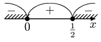

# MaTikZy - markup language for highschool math tikz

Demo page: https://www.matikzy.org

License: [GPLv3](./LICENSE.txt) - if you modify, you have to open source it.

_Keep in mind that most of this is vibe coded. But the language itself is not - its syntax and examples with tikz are made manually._

## Example

```
interval:
inline =-=[0]_+_[\frac12]=-=>x
arcs
```

makes



by turning it into this tikz code:

```
\begin{document}
\begin{tikzpicture}
% Axis
\draw[line width=1pt] (-4,0) -- (0,0);
\fill (0,0) -- (-0.2,0.1) -- (-0.2,-0.1) -- cycle;
\node[below, scale=1.5] at (-0.1,0) {$x$};
% Points
\fill (-3,0) circle (3pt);
\node[below, scale=1.5] at (-3,0) {$0$};
\fill (-1,0) circle (3pt);
\node[below, scale=1.5] at (-1,0) {$\frac12$};
% Arcs and signs
\node[above, scale=1.5] at (-3.7,0) {$-$};
\draw[thick] (-3,0) arc[start angle=0, end angle=90, x radius=1, y radius=0.7];
\node[above, scale=1.5] at (-2,0) {$+$};
\draw[thick] (-3,0) arc[start angle=180, end angle=0, x radius=1, y radius=0.7];
\node[above, scale=1.5] at (-0.3,0) {$-$};
\draw[thick] (-1,0) arc[start angle=180, end angle=90, x radius=1, y radius=0.7];
% Hatching
\foreach \x in {-4,-3.85,...,-3} {
    \draw[line width=1pt] (\x,0) -- (\x+0.20,0.20);
}
\foreach \x in {-1,-0.85,...,0} {
    \draw[line width=1pt] (\x,0) -- (\x+0.20,0.20);
}
\end{tikzpicture}
\end{document}
```

## API

60 requests per minute per IP.

```bash
curl -X POST -H "Content-Type: application/json" -d '{"lang":"matikzy", "content": "interval: \ninline =-=[0]_+_[\frac12]=-=>x\narcs"}' https://www.matikzy.org/render
```

returns

```svg
<svg xmlns="http://www.w3.org/2000/svg" width="163.398" height="53.71" viewBox="-72 -72 122.548 40.282"><defs><style>@import url(https://cdn.jsdelivr.net/npm/node-tikzjax@latest/css/fonts.css);</style></defs><g stroke="#000" stroke-miterlimit="10" stroke-width=".4"><path fill="none" stroke-width="1" d="M-69.973-51.953h113.81"/><path stroke="none" d="m43.838-51.953-5.69-2.846v5.691Z"/><text x="43.838" y="-51.953" stroke="none" font-family="cmmi10" font-size="10" transform="matrix(1.5 0 0 1.5 -29.05 37.734)">x</text> ...</svg>
```

## Setup

```bash
docker compose up -d
```

Then open http://localhost:3001

Edit `matikzy.js` file syntaxCheck and compile functions for additional language rules.

## About

Main purpose - make diagrams for math problems for vbesort.lt public use, for teachers to use and for MB Šimtukas internal usage.

The idea of syntax and tikz formatting is "humanly" thought of. But the code - most of it is vibe coded... since it needs very fast delivery. Later it might be cleaned up and more humanly made.

## Syntax

See DOCS.md
