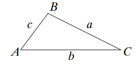

# Notes

## Intervals

1. arcs - all, closed-only, no-left, no-right, none.
2. points - hallow, filled, tick.
3. regions - hatched, not hatched.
4. above - region labels.
5. below - up down arrows.
6. left labels - above, below.
7. axis arrow and label.
8. mark min
9. parabola: `interval-parabola[down]: ...`

mark min:

```
interval-arcs[closed-only]: ^{V'(\alpha)}_{V(\alpha)} __ (0) _+_up [^{\arcsin \frac{\sqrt3}{3}}]{x_{max}} _-_down (\frac{\pi}{2}) __ >\alpha
```

TODO:

- individual points on line
- overlapping intervals

## Unit circle

1. Template
2. Rotable - enum/rad/deg, label, point (hallow, fill, none; label)

TODO:

- spiral rotation
- x-line y-line, other elements

## Functions

1. Axes - from,to. (default suggestion - [-3;3])
2. Grid - yes,no; Small - yes,no
3. Ticks - all,listed(label).
4. Point - filled,hollow,nothing;label;dotted-line-to-axis-x;dotted-line-to-axis-y
5. graph - xfromto;yfromto;TYPE;transform(f(x) form)
6. area - bucket fill with one point coords; label in center.

TYPE:

- line (y=kx+b (with a/b fractions); 2 points; x=a)
- parabola (abc;amn;axx) - `graph parabola y=ax^2+bx+c`, `y=a(x-x_1)(x-x_2)`, `y=a(x-m)^2+n`, `(x;y) (x_2;y_2) (x_3; y_3)`
- hyperbola (k=sth) for y=k/x
- cubic (can give 4 points), sqrt, cbrt
- log, exp (a=2 or a=1/2 or a=0.5), default a=2
- circle (x,y,r) - (0;0) r=3
- sin,cos,tg,ctg or tan cot - scaled so 1 means pi/2
- generic[smooth] - cubic bezier (verteces and passing points)

`graph generic[smooth] (2;0) v(3;2) v(4;4)`

xfromto, yfromto: nothing, x[2;3], x[2;], x[;2]

transform:

```
  >>f(x)+a
  >>f(x+a)
  >>-f(x)
  >>af(x)
  >>f(-x)
  >>f(ax)
  >>|f(x)|
```

```
  Parabola — exactly one of:
  - graph parabola y=ax^2+bx+c — e.g. y=2x^2-3x+1
  - graph parabola y=a(x-m)^2+n — e.g. y=-(x+2)^2+5
  - graph parabola y=a(x-r1)(x-r2) — e.g. y=2(x-1)(x+3)
  - graph parabola (x1;y1) (x2;y2) (x3;y3) — 3 points
  - graph parabola alone - draws x^2

  Cubic — exactly one of:
  - graph cubic y=ax^3+bx^2+cx+d — e.g. y=x^3-2x^2+x
  - graph cubic (x1;y1) (x2;y2) (x3;y3) (x4;y4) — 4 points
  - graph cubic alone — draws x^3
```

`angle right (x1;y1) (x2;y2) (x3;y3) label`

Fixes done:

- small graph dots not scale. DONE
- parabola with 3 points. DONE
- angles. DONE
- scale axes. DONE
- medium scale; make tick labels a bit smaller... for medium and for small. DONE
- f(x-1) transformation DONE
- naming axes DONE
- make medium scale the default - rn it's too big. DONE
- generic line can go not like function DONE

## Geometry - triangles

```
geometry:
triangle ABC
```

```
triangle scalene right [A]BC
triangle scalene obtuse [A]BC
triangle scalene acute ABC
triangle isosceles right [A]BC
triangle isosceles obtuse [A]BC
triangle isosceles acute A[B]C
~triangle equilateral right [A]BC~
~triangle equilateral obtuse [A]BC~
triangle equilateral acute ABC
```

With shortest versions being:

```
triangle right
triangle obtuse
triangle
triangle isosceles right
triangle isosceles obtuse
triangle isosceles
NOT POSSIBLE
NOT POSSIBLE
triangle equilateral
```

Default is [A]BC, starting bottom left, then up, then bottom right.

- `<sides>` equilateral, isosceles, [scalene]
- `<angles>` right, obtuse, [acute]

the default `triangle`:



```
geometry:
triangle ABC
label AB k
label b l
label CB m
```

```
AB - BA - c
BC - CB - a
AC - CA - b
```

label in center of segment. on which side? idk, for triangle outside, otherwise random... After that we'll see. maybe just default is left. But can specify with

`label AB k right` WIP!

the label itself is optional, defaults to the vertex in front, lowercase.

Let's do the same with verteces.

```
label A label B label C
```

And with angles:

```
label ABC \beta label BAC bigger \alpha label angle A 1
```

default for angle: 1, 2, 3..

mark:

```
geometry:
triangle ABC
mark A
mark AB III
mark ABC II
```

```
mark ABC II
mark ABC bigger II
mark angle B II
mark angle C right
```

triangle lines:

- perpendicular bisector
- angle bisector
- median
- altitude
- midsegment

```
geometry:
triangle KLM
line perpendicular bisector KLM KL new G H
line angle bisector KLM new K G
line median KLM K new G
line altitude KLM K new G
line midsegment KLM KL LM new G H
```

point in segment:

```
geometry:
triangle KLM
point KL 1:4 new H
mark H
label H
```

general lines:

- line
- segment
- ray

```
geometry:
triangle KLM
point KL 1:3 new H
point KM 1:2 new G
line KL
line segment LG
line ray MH
```

TO FIX:

- SYNTAX CHECK - make sure element namings are not repeating.

## geometry circle

make new, as basis, like triangle. triangle should not exist here.

```
geometry:
circle A-AB
```

B is to the right, at 0 degrees.

```
point A-AB 120 new G
```

TODO: find shortcut to not mention circle A-AB, so that it defaults to O-OX.

GENERAL GEOMETRY NOTES:

can draw either triangle or circle as BASIS. after that drawing either is only based on existing points and segments.

### label position

for point choose "top bottom left right", for segment choose "left right".

```
label A B -- top right
label AB a -- left
```

TODO: FIX THIS SYNTAX WITH DASHES

### intersection point

```
point AB intersect BC new K
```

### triangle with lenths and angles and rotation

Around 3-6 point length sides. Based on triangle congruence rules:

SSS, SAS, ASA and AAS.

```
geometry:
triangle SSS 3 4 6 ABC
triangle SAS 3 120 4 ABC
triangle ASA 120 3 30 ABC
triangle AAS 120 30 3 ABC
```

Rotation clockwise (same direction as triangle naming starts). no angle specified - rotate so next side is on bottom. Or inverting.

```
... >>rot >>rot >>rot125 >>invert
```

### circle tangent and other

```
geometry:
circle O-OX
line tangent O-OX X new Y
line segment XY
```

line segment XY cuts off the (if existing) line excess.

```
geometry:
triangle
circle inscribe ABC new O-OX K L M
circle circumscribe ABC new O-OX
```

Inscribing into triangle - KLM are the touchpoints (each is in the opposite of correcpoinding mentioned triangle vertex: ABC - KLM - BC,AC,AB). And Circumscribing around triangle.

TODO:

- in geometry - area shading.

### geometry quadrilateral

also basis figures only here. Again starting from bottom left, going clockwise with notation ABCD (default is ABCD).

Includes rotation, like in triangle.

```
geometry:
quadrilateral square ABCD
```

```
quadrilateral square ABCD
quadrilateral rectangle ABCD
quadrilateral parallelogram ABCD
quadrilateral rhombus ABCD
quadrilateral trapezoid ABCD
quadrilateral right trapezoid ABCD
quadrilateral isosceles trapezoid ABCD
quadrilateral SSSSD 1 2 3 4 2 ABCD
quadrilateral SSSDD 1 2 3 2 3 ABCD
quadrilateral SSAAA 3 3 90 90 90 ABCD
quadrilateral SSSAA 3 3 3 90 90 ABCD
```

Free form (D-diagonal):

- SSSSD
- SSSDD
- SSAAA (adjacent S)
- SSSAA (included A)
